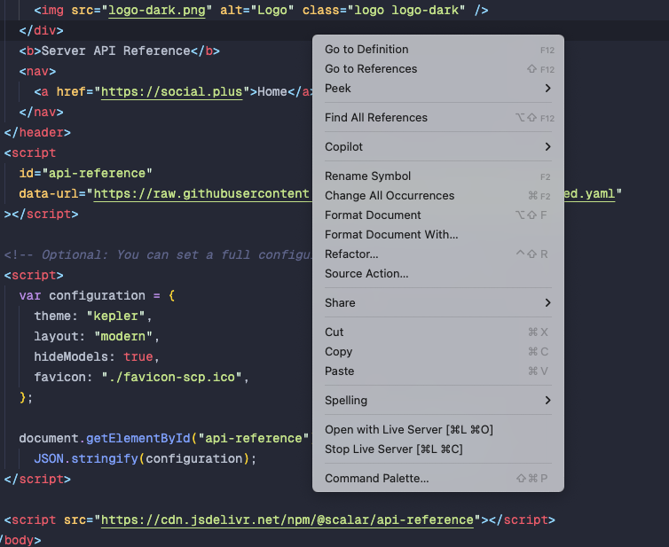

# Social+ API Documentation

For comprehensive information, please visit [Social+ API Docs](https://api.docs.social.plus).

## Validation

To validate `swagger.yaml`, you can use the [redocly-cli](https://github.com/Redocly/redocly-cli) tool.

### Installation

Install the redocly using npm:
```bash
npm install
```

### Usage

Validate the OpenAPI specification with the following command:
```bash
npm run lint
```

## Running a Local Server

To run a local server, follow these steps:

1. Install [Live Server](https://marketplace.visualstudio.com/items?itemName=ritwickdey.LiveServer), a VSCode extensions:

2. Bundle the swagger document:

```bash
npm run build
```

3. Start Live server in `index.html` file in root directory:




