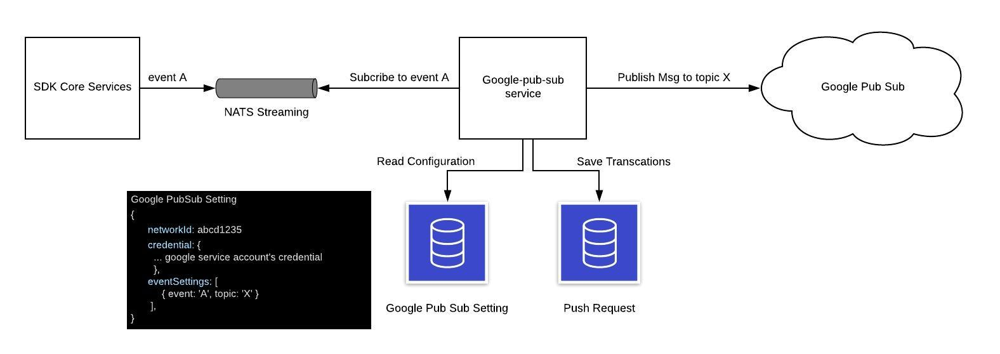

# GooglePubSub Design Document

## What is GooglePubSub?

GooglePubSub is one of a feature that allows external parties to subscribe to events that happens in Messaging SDK Server via GooglePubSub SDK. By providing us thier GoogleServiceAccount along with the mapping between SDK events and topics that they want us to push messages to, we can easily config our SDK so that it alway notify our external parties whenever any event happens.

## Google Pub Sub Overview Design



## GooglePubSub Configuration Setup

1. Asking for our customer to provide Google service account's credential json file. This service account have to has permission to publish messages to the designate topic.

   Example credential json:

   ```json
   {
     "type": "service_account",
     "project_id": "...",
     "private_key_id": "...",
     "private_key": "...",
     "client_email": "...",
     "client_id": "...",
     "auth_uri": "...",
     "token_uri": "...",
     "auth_provider_x509_cert_url": "..",
     "client_x509_cert_url": "..."
   }
   ```

2. Create a record of document in google-pub-sub-setting collection in mongodb

   Example record

   ```json
   {
     "networkId": "xxxxxx",
     "credential": {
       "type": "service_account",
       "project_id": "...",
       "private_key_id": "...",
       "private_key": "...",
       "client_email": "...",
       "client_id": "...",
       "auth_uri": "...",
       "token_uri": "...",
       "auth_provider_x509_cert_url": "..",
       "client_x509_cert_url": "..."
     },
     "eventSettings": [
       {
         "event": "A",
         "topic": "X"
       }
     ]
   }
   ```

   | fields        | Description                                                                                                        |
   | ------------- | ------------------------------------------------------------------------------------------------------------------ |
   | networkId     | customer network Id whom we publish messages to                                                                    |
   | credential    | Google service account's credential                                                                                |
   | eventSettings | a list of event-topic mapping. In the example, whenever event "A" happens, the system will push event to topic "X" |

## GooglePubSub Event and Data

please see [Swagger](https://api.ekomedia.technology/docs/#/GooglePubSub) for more info
